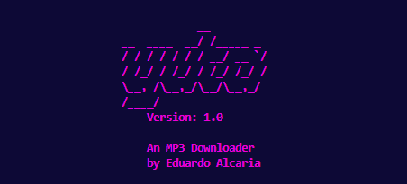

# Yuta, an MP3 Downloader




> This project is an MP3 downloader with a CLI interface and features such as link authentication, a system that allows users to download to a specific path, and a playlist downloader.

### APIs and other technologies
In this project, I used APIs such as:
- **[PYTUBEFIX](https://github.com/JuanBindez/pytubefix) from JuanBindez**
- **[RICH CONSOLE](https://github.com/Textualize/rich) from willmcgugan**


## 🚀 Instaling Yuta
To install Yuta, clone this repository:

For Linux, macOS, or Windows:

```
git clone https://github.com/EduardoAlcaria/Yuta-MP3-Downloader.git
```
## 💻 Requirments :
Run this command in the terminal (once inside Yuta's cloned folder) to install all the required packages:
```
pip install -r requirements.txt
```

## ☕ Using Yuta

To use Yuta, follow these steps:
- Run the Yuta file in a terminal or by simply running the Python file.
- Once it's running, paste any YouTube link, whether it's a playlist or a single video.
- Yuta will ask for a download path. You can:
   - Press Enter to download the music in the current folder.
   - Type a name, and Yuta will create a directory inside your current folder.
   - Provide a path.
   - Provide a path and add a \ and a name to create a folder inside your current folder.

## FOR EDUCATIONAL PURPOSES ONLY. NOT RESPONSIBLE FOR COPYRIGHT INFRINGEMENT.
